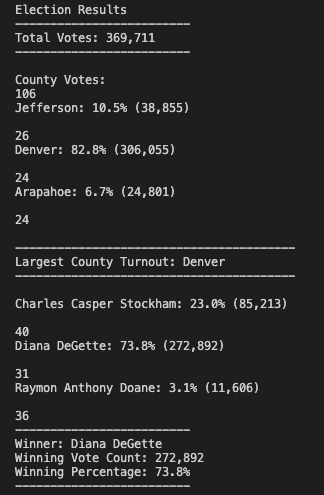
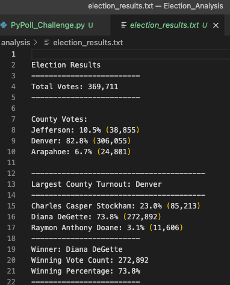

# Election_Analysis
## Overview of Election Audit
The Colorado Board of Elections requested an audit of a recent congressional election and gave the following task:
#### 1. The total number of votes cast.
#### 2. A complete list of candidates who received votes.
#### 3. The percentage of votes each candidate won.
#### 4. The total number of votes each candidate won.
#### 5. The winner of the election based on popular vote.

## Election Audit Results
1. Total Votes in the Colorado Board of Elections: 369,711

2. County Votes:
 - Jefferson: 10.5% (38,855)
 - Denver: 82.8% (306,055)
 - Arapahoe: 6.7% (24,801)

3. Largest County Turnout: Denver

4. Votes by Candidate:
 - Charles Casper Stockham: 23.0% (85,213)
 - Diana DeGette: 73.8% (272,892)
 - Raymon Anthony Doane: 3.1% (11,606)

5. Winner of the Election: 
 - Winner: Diana DeGette
 - Winning Vote Count: 272,892
 - Winning Percentage: 73.8%

### Terminal Printout of Results

### Text file Printout of Results

## Election Audit Summary

This script can be used for any election, but it will be necessary to use the data source in the same format as was used in this analysis. 
For example, this script will only execute CSV files. Also, it should be noted that in a data source file, candidate names and county names should be in the same columns as the file we used in our analysis. If candidate names and county names are in different columns, the code will need to be modified.

The second example of modifying this script is including more characteristics, such as social, demographics, geography, or even using the electoral college outcome.
